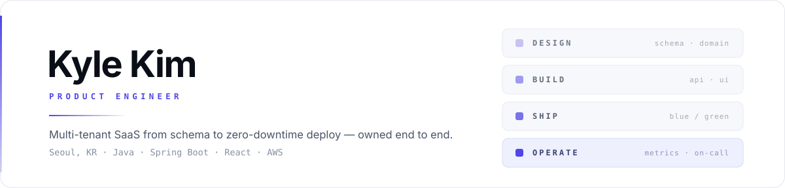
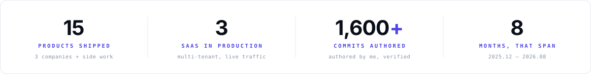
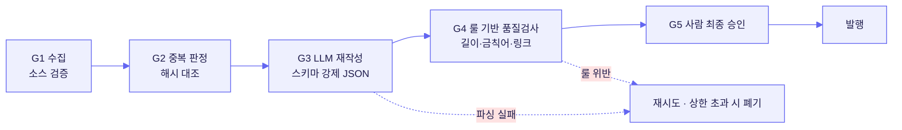
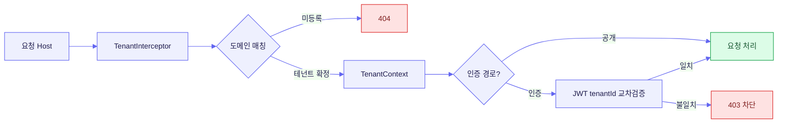

<div align="center">

<picture>
  <source media="(prefers-color-scheme: dark)" srcset="assets/hero-dark.svg">
  
</picture>

<br><br>

<picture>
  <source media="(prefers-color-scheme: dark)" srcset="assets/metrics-dark.svg">
  
</picture>

</div>

<br>

> **김태민 · Kyle Kim**
>
> 멀티테넌트 SaaS를 스키마 설계부터 무중단 배포·운영까지 혼자 책임집니다.
> 지금은 **BARO**에서 프로덕션 트래픽을 받는 SaaS 3종을 만들고 굴리고 있습니다.

<br>

**목차**
&nbsp;·&nbsp; [01 About](#01--about)
&nbsp;·&nbsp; [02 AI Leverage](#02--ai-leverage)
&nbsp;·&nbsp; [03 Selected Work](#03--selected-work--baro)
&nbsp;·&nbsp; [04 Engineering Principles](#04--engineering-principles)
&nbsp;·&nbsp; [05 Earlier Work](#05--earlier-work)
&nbsp;·&nbsp; [06 Stack](#06--stack)
&nbsp;·&nbsp; [07 Contact](#07--contact)


## `01` &nbsp; About

한 사람이 기획 · 스키마 · 백엔드 · 프론트엔드 · 인프라 · 배포 · 운영을 끊기지 않고 가져갑니다.

중간에 넘기지 않기 때문에, 장애의 원인이 쿼리 플랜에 있든 nginx 설정에 있든
같은 사람이 추적해서 고칩니다. 인수인계 비용이 0인 대신, 모든 결정의 책임도 한 사람에게 남습니다.

그래서 **판단이 틀렸을 때 빠르게 드러나는 구조**를 먼저 만듭니다.
아키텍처 규칙은 문서가 아니라 빌드에, 스키마 변경은 마이그레이션 한 경로로, 배포는 되돌릴 수 있게.

<br>

| 시기 | 소속 | 역할 | 무엇을 책임졌나 |
|:--|:--|:--|:--|
| **2025.12 – 현재** | **BARO** | Product Engineer · 1인 E2E | 멀티테넌트 SaaS 3종의 설계 · 개발 · 배포 · 운영 |
| **~ 2025** | **beo** | Full-stack · 단독 | 쿠팡 셀러용 수집기와 이커머스 성과분석 플랫폼 |
| **~ 2024** | **goodsen** | Software Engineer | 채용 자동화 · 전자책 커머스 · SNS 계정 통합 관리 |

<br>

다뤄본 도메인은 중고차 리스, 이커머스, 세무회계, 채용, 광고입니다.
매번 그 업계의 실제 업무 흐름을 먼저 이해한 뒤에 기능을 정의했습니다.


## `02` &nbsp; AI Leverage

> [!IMPORTANT]
> AI를 코드 자동완성으로 쓰지 않습니다. 두 갈래로 씁니다.
> **(A) 제품 안에 신뢰 가능한 부품으로 넣고**, **(B) 제 자신의 처리량을 배수로 올리는 데 씁니다.**

<br>

### A. 제품에 들어간 AI — LLM을 "신뢰 가능한 파이프라인 부품"으로

LLM은 기본적으로 **비결정적이고, 조용히 틀리고, 요금이 붙는 외부 의존성**입니다.
그래서 저는 LLM 호출을 하나의 함수가 아니라 **4계층으로 분해**해서 다룹니다.

```
프롬프트 (버전 관리)  →  가드 (입력 검증 · 토큰/비용 상한)
                      →  파싱 (JSON 스키마 강제 · 실패 시 폐기)
                      →  재시도 (지수 백오프 · N회 초과 시 사람에게 에스컬레이션)
```

이렇게 분리하면 **LLM이 실패해도 시스템은 실패하지 않습니다.**
파싱에서 떨어진 응답은 DB에 닿지 않고, 재시도 상한을 넘긴 작업은 큐에 남아 사람에게 넘어갑니다.

<br>

#### 사례 1 &nbsp;·&nbsp; 뉴스 인제스트 파이프라인 — 사람이 손대는 구간을 1회로

**문제**
&nbsp; 마케팅 인사이트 콘텐츠를 담당자가 매번 직접 수집 · 선별 · 요약 · 발행했습니다.
반복적이고, 사람마다 톤이 다르고, 무엇보다 **다른 일을 밀어냈습니다.**

**설계**
&nbsp; 수집부터 발행까지를 **5단계 게이트**로 쪼개고, 각 게이트를 통과하지 못한 건은 다음 단계로 넘어가지 못하게 했습니다.



**결과**
&nbsp; 사람이 개입하는 구간이 **전 과정 → 최종 승인 1회**로 줄었습니다.
LLM이 만들어낸 문장이 룰 검사 없이 그대로 발행되는 경로는 **구조적으로 존재하지 않습니다.**

<!-- 권장: 아래 한 줄을 실측치로 채우면 설득력이 크게 올라갑니다.
     예) "발행 1건당 담당자 소요 시간 42분 → 4분 (n=30건, 2026.05 측정)"
     예) "월 발행량 12건 → 88건, 담당자 투입 시간은 오히려 감소" -->

<br>

#### 사례 2 &nbsp;·&nbsp; 브랜드 광고비 인사이트 — 판단은 사람, 정리는 LLM

원본 광고 집행 데이터를 LLM이 **요약이 아니라 구조화**합니다.
자유 서술이 아니라 고정 스키마(브랜드 · 채널 · 증감률 · 특이사항)로만 응답하게 강제하고,
스키마를 벗어난 응답은 파싱 단계에서 버립니다.

결과는 알림톡 발송까지 자동으로 이어지며,
**"AI가 이렇게 판단했다"가 아니라 "이 숫자가 이렇게 움직였다"만 전달**하도록 출력 범위를 좁혔습니다.

<br>

#### 사례 3 &nbsp;·&nbsp; PlanFlow AI 어시스트 — 제안까지만, 실행은 사람

스마트 태스크 배정, 리스크 · QA 루프, 기획 제안 기능입니다.
**AI는 제안 상태(pending)로만 쓰기 권한을 가지며**, 실제 상태 전이는 사용자의 수락을 거칩니다.

AI 기능을 붙일 때 가장 먼저 정한 것은 모델이 아니라 **AI가 건드릴 수 있는 데이터의 범위**였습니다.

<br>

### B. 개발 자체에 쓴 AI — 그리고 그 대가로 무엇을 지불했나

8개월 동안 15개 제품, 1,600+ 커밋.
이 속도는 AI 없이는 불가능했고, **AI만으로도 불가능했습니다.**

> [!WARNING]
> AI로 코드를 빠르게 만들면, 병목은 작성이 아니라 **검증**으로 옮겨갑니다.
> 사람이 눈으로 리뷰하는 방식은 이 속도에서 반드시 무너집니다.

그래서 저는 **검증을 사람에서 빌드로 옮겼습니다.** 이게 제 AI 활용의 핵심입니다.

| 생성 속도가 만드는 위험 | 이 위험을 막는 장치 | 실패 시점 |
|:--|:--|:--|
| 모듈 경계를 넘는 참조 | **ArchUnit 8종 규칙** | 빌드 실패 |
| 인가 어노테이션 누락 | ArchUnit + 컨트롤러 스캔 | 빌드 실패 |
| `WHERE org_id` 누락 | **테넌시 자동 주입** — 잊을 수 *없는* 구조 | 컴파일 단계 |
| 스키마와 쿼리의 조용한 불일치 | **jOOQ 코드젠** (매 빌드, 마이그레이션 기준) | 컴파일 실패 |
| 로그 · 응답의 PII 평문 노출 | ArchUnit + PII 분리 테이블 + AES-256-GCM | 빌드 실패 |
| 시크릿 커밋 | **gitleaks CI** | CI 차단 |
| 실제 DB에서만 터지는 쿼리 | **Testcontainers** 통합 테스트 (206개 테스트 파일) | CI 실패 |

**작업 루프**는 이렇게 돕니다.

```
마스터플랜 문서(단일 기준선)  →  AI에 컨텍스트로 공급  →  스펙 기반 생성
                                                      →  ArchUnit · gitleaks · Testcontainers 검증
                                                      →  통과한 것만 사람 리뷰
```

문서와 코드가 어긋나면 **문서를 기준으로 삼습니다.**
코드를 고치거나, 근거를 단 개정 PR로 문서를 바꾸거나 — 둘 중 하나만 허용합니다.

<br>

**한 줄로 요약하면**

<!-- 이 문장이 이 README에서 가장 중요한 한 줄입니다. -->

> AI는 코드를 빠르게 만들어줄 뿐, 옳게 만들어주지는 않습니다.
> 그래서 저는 **"옳음"의 판정을 리뷰어의 주의력에서 빌드 파이프라인으로 옮기는 일**에 시간을 씁니다.
> 속도는 AI가, 안전망은 제가 만듭니다.


## `03` &nbsp; Selected Work — BARO

<br>

### 01 &nbsp;·&nbsp; Link24 &nbsp;—&nbsp; 멀티테넌트 중고차 · 리스 시세 / 리드 SaaS

<sub>
<b>2025.12 – 2026.07</b> &nbsp;|&nbsp; 실질 단독 개발 &nbsp;|&nbsp; 커밋 <b>698 / 796</b> &nbsp;|&nbsp; <code>v0.42.0</code>
</sub>

<br><br>

**하나의 빌드가 접속 도메인에 따라 서로 다른 고객사의 테마 · 정책 · 데이터로 동작합니다.**
방문자가 차량 시세를 조회하고 상담을 남기면, 그 리드가 공정 분배 로직을 거쳐 딜러에게 자동 배정됩니다.

<br>

**가장 어려웠던 문제 — 교차 테넌트 접근**

멀티테넌시에서 가장 위험한 실패는 장애가 아니라 **A사 고객이 B사 데이터를 보는 것**입니다.
이건 조용히 발생하고, 발생한 뒤에는 되돌릴 수 없습니다.

그래서 테넌트 판별을 애플리케이션 로직이 아니라 **요청 진입점**에 두고, 인증 경로에서는 한 번 더 교차검증합니다.



<table>
<tr><td width="52%" valign="top">

**직접 설계 · 구현**

- **테넌트 격리** — 호스트 기반 해석 + JWT `tenantId` 교차검증
- **시세 read path** — 캐시 · 조회수 롤업 · rate limit이 얽힌 공개 조회 경로를 단일 진입점으로 통합
- **공정 배정 엔진** — 가중치 · 일/시간 상한 · 쿨다운 조합
- **사이트 디자인 스튜디오** — 테넌트가 자기 사이트의 섹션 · 색상 · 템플릿을 직접 편집
- **위임 대행(login-as)** — 세션 시작 · 회수 · 전 구간 감사 로그
- **외부 시세 적재 API** — 토큰 + IP/CIDR 가드

</td><td valign="top">

**규모와 운영**

| | |
|:--|--:|
| Java 클래스 | **403** |
| 컨트롤러 | **45** |
| 스키마 DDL | **1,251줄** |
| `.ts` / `.tsx` | **637** |
| 테스트 파일 | **206** |

<br>

- **ALB 타겟그룹 스왑 blue/green 무중단 배포**
- GitHub Actions self-hosted 러너
- Actuator + Prometheus 관측

</td></tr>
</table>

<sub>
Spring Boot 3.2 &nbsp;·&nbsp; Java 17 &nbsp;·&nbsp; QueryDSL &nbsp;·&nbsp; MySQL 8 &nbsp;·&nbsp; Redis &nbsp;·&nbsp; React 19 &nbsp;·&nbsp; TypeScript 5.9 &nbsp;·&nbsp; Vite 7 &nbsp;·&nbsp; Tailwind 4 &nbsp;·&nbsp; AWS EC2 · ALB · S3
</sub>

<br><br>

### 02 &nbsp;·&nbsp; BARO Homepage &nbsp;—&nbsp; 공개 사이트 + 운영 콘솔 + 통합 인증 모노레포

<sub>
<b>2026.03 – 현재</b> &nbsp;|&nbsp; 주도 &nbsp;|&nbsp; 커밋 <b>581 / 749</b> &nbsp;|&nbsp; <code>v0.30.0</code>
</sub>

<br><br>

**공개 웹사이트 4종, 운영 백오피스, 인증 인프라를 한 저장소에서 운영합니다.**
방문자는 포트폴리오와 마케팅 인사이트를 보고 문의 · 결제까지 진행하고,
임직원은 SSO로 로그인해 콘텐츠 · 고객사 · 권한 · 결제를 한곳에서 관리합니다.

<br>

**결정한 것 — 인증을 애플리케이션에서 떼어낸 이유**

앱이 5개인데 인증 로직이 5벌이면, 권한 정책 한 줄을 바꿀 때 다섯 군데를 고쳐야 합니다.
그래서 **통합로그인 BFF를 별도 서비스로 분리**하고, Keycloak 26을 신원 소스로, RBAC(`resource:action`)를 DB에 두었습니다.

대가는 런타임이 둘로 늘어난 것(EC2 Docker Compose + ECS Fargate)이고,
얻은 것은 **권한 정책 변경이 배포 없이 반영된다**는 점입니다.

<table>
<tr><td width="52%" valign="top">

**직접 설계 · 구현**

- **인증 인프라 분리** — Keycloak 26 SSO + DB 기반 RBAC, 통합로그인 BFF 독립 서비스화
- **포트폴리오 에디터** — 문서형 캔버스, 실시간 분할 미리보기, 낙관적 잠금, 소프트 삭제 / 휴지통
- **고객사 360° 워크벤치** — 문의 · 결제 · 계약 이력을 한 화면으로
- **문의 티켓 처리대** — 2-pane, 배정 · 상태 전이 · 전환 계측
- **감사 로그** — 변경 전 / 후 diff 추적
- **LLM 뉴스 인제스트** — [사례 1](#사례-1--뉴스-인제스트-파이프라인--사람이-손대는-구간을-1회로) 참조

</td><td valign="top">

**규모와 운영**

| | |
|:--|--:|
| 프론트 앱 | **5** |
| 백엔드 도메인 | **13** |
| Flyway 마이그레이션 | **123** |
| CI/CD 워크플로 | **6** |

<br>

- main · hub · careers · web-production · admin
- **edge nginx graceful reload blue/green 무중단 배포**
- EC2 Docker Compose + ECS Fargate 이원 런타임

</td></tr>
</table>

<sub>
Spring Boot 4.0.3 &nbsp;·&nbsp; Java 17 &nbsp;·&nbsp; Keycloak 26 &nbsp;·&nbsp; MySQL RDS &nbsp;·&nbsp; Flyway &nbsp;·&nbsp; React 19 &nbsp;·&nbsp; pnpm 10 &nbsp;·&nbsp; AWS EC2 · ECS · RDS &nbsp;·&nbsp; Playwright
</sub>

<br><br>

### 03 &nbsp;·&nbsp; BAROS 2.0 &nbsp;—&nbsp; 리드 수집 → 배분 → 결과 학습 3계층 SaaS

<sub>
<b>2026.07 –</b> &nbsp;|&nbsp; 아키텍처 하네스 설계 · 부트스트랩 &nbsp;|&nbsp; 3인 병렬 개발 전제
</sub>

<br><br>

**자동차 리스 · 렌트 리드를 모바일 랜딩으로 모아 → 규칙대로 배분하고 → 계약 결과를 되받아 학습하는 플랫폼입니다.**

이 프로젝트에서 제 역할은 기능을 많이 만드는 게 아니라,
**레거시에서 반복되던 결함이 다시는 사람의 주의력에 의존하지 않도록 골격을 세우는 것**이었습니다.

<br>

<table>
<tr><th width="36%" align="left">빌드가 막는 것</th><th align="left">어떻게</th></tr>
<tr><td valign="top"><b>모듈 경계 붕괴 · 인가 누락<br>문자열 SQL · 로그 PII</b></td><td valign="top"><b>ArchUnit 8종 규칙</b><br>위반하면 리뷰가 아니라 <b>빌드에서 떨어집니다.</b></td></tr>
<tr><td valign="top"><b>권한 상승</b></td><td valign="top"><b>테넌시 자동 주입</b><br><code>WHERE org_id = ?</code>를 개발자가 잊을 수 <b>없는</b> 구조</td></tr>
<tr><td valign="top"><b>스키마와 쿼리의 조용한 불일치</b></td><td valign="top"><b>jOOQ 코드젠</b>이 매 빌드마다 마이그레이션에서 출발</td></tr>
<tr><td valign="top"><b>PII 평문 노출<br>중복판정 풀스캔</b></td><td valign="top"><b>PII 분리 테이블</b> + AES-256-GCM 암호화 + HMAC 해시 검색</td></tr>
<tr><td valign="top"><b>시크릿 커밋</b></td><td valign="top"><b>gitleaks CI</b></td></tr>
<tr><td valign="top"><b>가짜 성공 응답<br>조용히 흡수되는 INSERT 실패</b></td><td valign="top"><b>트랜잭션 경계 = 응답 경계</b></td></tr>
</table>

<br>

**구조** &nbsp; 단일 배포 단위 위의 **모듈러 모놀리스 11모듈**.
모듈 간에는 상대의 `api` 인터페이스만 참조하고, 엔티티 공유와 크로스 JOIN은 금지합니다.

비동기는 도메인 이벤트로 — `ApplicationEventPublisher` → `outbox` → SQS.
진행은 날짜가 아니라 **게이트 G0~G5**로 관리합니다. 게이트를 통과하지 못하면 다음 단계로 넘어가지 않습니다.

<sub>
Spring Boot 3.3 &nbsp;·&nbsp; jOOQ &nbsp;·&nbsp; Testcontainers &nbsp;·&nbsp; ArchUnit &nbsp;·&nbsp; Flyway &nbsp;·&nbsp; MySQL &nbsp;·&nbsp; Redis &nbsp;·&nbsp; Node 20 SSR Worker
</sub>

<br>

<details>
<summary><b>&nbsp;사내 자동화 도구 · 데이터 파이프라인 4종</b> &nbsp;<sub>펼쳐보기</sub></summary>

<br>

**Call Matcher** `v1.4.0` &nbsp;—&nbsp; <sub>Python · PySide6 · gspread</sub>

손으로 정리한 콜보고를 업체별 **문자(SMS)** · **050 콜로그(CDR)** 와 자동 대조하고, 결과를 Google Sheets로 전송합니다.
콜보고에 풀번호가 있으면 정확 매칭하고, 없으면 **뒷 4자리로 폴백**합니다. AM팀에 단일 `.exe`로 배포했습니다.

<br>

**AI Task Pipeline** &nbsp;—&nbsp; <sub>Spring Boot · OpenAI · Gemini</sub>

뉴스 심사 · 재작성, 브랜드 광고비 인사이트 같은 LLM 작업의 공통 실행 기반입니다.
프롬프트 · 가드 · 파싱 · 재시도를 분리해, LLM 실패가 서비스 실패로 전이되지 않게 했습니다.

<br>

**Ad / Log 대시보드** &nbsp;—&nbsp; <sub>React · Vite</sub>

광고 집행 관리와 네거티브 클릭 로그 분석 프론트엔드.

<br>

**Cars Data Pipeline** &nbsp;—&nbsp; <sub>Python · MySQL</sub>

차량 카탈로그 · 시세 원본을 정규화해 서비스 DB로 적재합니다.

</details>


## `04` &nbsp; Engineering Principles

> [!TIP]
> 아래는 슬로건이 아니라, 실제 운영 중인 저장소에 규칙으로 들어가 있는 항목입니다.

<br>

<table>
<tr>
<td width="50%" valign="top">

**규칙은 문서가 아니라 빌드가 지킨다**

모듈 경계 · 인가 누락 · 문자열 SQL · 로그 PII를 ArchUnit 규칙으로 **빌드 실패** 처리합니다.

리뷰어의 주의력에 의존하는 규칙은, 바쁜 주에 가장 먼저 무너집니다.

</td>
<td width="50%" valign="top">

**문서와 코드가 어긋나면 문서가 옳다**

마스터플랜을 단일 기준선으로 두고,
불일치는 **코드를 고치거나 근거를 단 개정 PR**로만 해소합니다.

기준선이 흔들리면 AI에 넣을 컨텍스트도 같이 썩습니다.

</td>
</tr>
<tr>
<td valign="top">

**스키마 변경 경로는 하나뿐이다**

Flyway 전용 · 타임스탬프 파일명 · 인덱스 필수.

직접 DDL과, 병렬 개발 시의 번호 충돌을 구조적으로 차단합니다.

</td>
<td valign="top">

**배포는 되돌릴 수 있어야 한다**

blue/green 무중단 배포 + 헬스체크 기반 전환.

릴리스는 SemVer / Keep a Changelog로 자동화합니다.

</td>
</tr>
<tr>
<td valign="top">

**민감정보는 정책이 아니라 구조로 분리한다**

PII 별도 테이블 · AES-256-GCM 암호화 · HMAC 해시 검색 · gitleaks CI.

"조심하기"는 대책이 아니라고 봅니다.

</td>
<td valign="top">

**AI는 출력 범위를 먼저 정하고 붙인다**

모델 선택보다 먼저 정하는 것은 **AI가 건드릴 수 있는 데이터의 범위**입니다.

제안까지만, 실행은 사람이.

</td>
</tr>
</table>


## `05` &nbsp; Earlier Work

<br>

### beo &nbsp;—&nbsp; 쿠팡 구매량 추적기 · 이커머스 성과분석 플랫폼 &nbsp;<sub>단독 개발</sub>

**쿠팡 셀러가 흩어져 보던 광고 · 매출 · 키워드 데이터를 한 화면으로 모았습니다.**

크롬 확장 프로그램이 상품별 판매 추이를 자동 수집하고,
대시보드가 그 데이터를 마진 · 광고 효율(ROAS) · 키워드 순위로 풀어냅니다.

수작업 취합을 자동화해, 셀러가 **데이터 정리가 아니라 판단에 쓸 시간**을 남기는 게 목표였습니다.

<sub>Vue 3 &nbsp;·&nbsp; Spring Boot 3.2 &nbsp;·&nbsp; Redis &nbsp;·&nbsp; AWS &nbsp;·&nbsp; Chrome Extension</sub>

<br>

### goodsen &nbsp;—&nbsp; 사내 자동화 · 커머스 3종

**인사팀 채용 자동화 프로그램** &nbsp;·&nbsp; <sub>Python · Selenium · Desktop</sub>
브라우저에서 손으로 반복하던 채용 업무를 데스크톱 프로그램으로 자동화했습니다.
담당자 자체 측정 기준 **반복 처리 시간 약 60% 감소**.

**SNS 매체 계정 통합 관리 플랫폼**
계정마다 따로 로그인하던 구조를 단일 콘솔로 통합해 **120개 계정**을 한곳에서 관리합니다.
계정 수에 비례해 늘어나던 운영 비용을 구조적으로 끊어낸 작업입니다.

**OnClass — 전자책 이커머스** &nbsp;·&nbsp; <sub>Java · Spring · Vue.js · MySQL</sub>
전자책 상품의 등록 · 판매 · 결제까지 다루는 커머스 플랫폼.

<br>

### 외주 · 해커톤 · 사이드

**세무회계 현 — 홈페이지 + CRM 콘솔** &nbsp;<sub>2026.06 – 2026.07 · 외주 · 단독</sub>

공개 문의가 들어오면 이메일 / 전화 기준으로 고객 레코드에 자동 연결되고,
그 고객이 상담 · 세무기한 · 내부업무 · 후속조치 일정으로 이어집니다.

- 백엔드 도메인 **11종** — 고객 · 문의 · 세무건 · 업무 · 일정 · 문서 · 동의 · 활동로그 · 사이트 콘텐츠
- Flyway + `ddl-auto=validate`로 엔티티와 실제 스키마의 불일치를 **기동 시점에 차단**
- **H2 + Testcontainers 이중 테스트** — 빠른 피드백과 실제 마이그레이션 검증을 분리
- 브랜드 시스템 직접 설계 — 딥네이비 톤, 로고 라인드로우 애니메이션, `prefers-reduced-motion` 대응

<sub>React &nbsp;·&nbsp; TypeScript &nbsp;·&nbsp; GSAP &nbsp;·&nbsp; Spring Boot 3.5 &nbsp;·&nbsp; MySQL 8.4 &nbsp;·&nbsp; Playwright</sub>

<br>

**PlanFlow — 워크스페이스 우선 협업 플랫폼** &nbsp;<sub>2026.02 – 2026.07 · OpenAI × 조코딩 해커톤 · 1인 수행 · 커밋 275</sub>

프로젝트 · 일정 · 문서 · GitHub · 채팅을 워크스페이스 단위로 격리해 다룹니다.
기획부터 개발 · 제출까지 혼자 완주했습니다.

- 스프린트 / 에픽 · 보드 · 캘린더 · QA 항목 · 워크플로 제안
- STOMP / SockJS 기반 실시간 그룹 채팅 · DM · 프레즌스 · 알림 인박스
- GitHub App 연동 — 저장소 연결, 커밋 / PR 동기화, 태스크 ↔ PR 링크
- AI 어시스트 — 스마트 태스크 배정, 리스크 / QA 루프 ([사례 3](#사례-3--planflow-ai-어시스트--제안까지만-실행은-사람))
- 팀 자격증명 — reveal 플로우와 감사 기록을 갖춘 공유 시크릿 관리
- Polar 구독 결제 · 웹훅, S3 파일 스토리지, PDF / Office 텍스트 추출

<sub>Spring Boot 4 &nbsp;·&nbsp; Java 17 &nbsp;·&nbsp; MySQL 8 &nbsp;·&nbsp; Redis &nbsp;·&nbsp; React 19 &nbsp;·&nbsp; Vite 7 &nbsp;·&nbsp; STOMP / SockJS &nbsp;·&nbsp; OAuth2 + JWT</sub>

<br>

**OneStack — IT 전문가 매칭 & 협업 플랫폼** &nbsp;<sub>사이드 팀 프로젝트 · 팀장</sub>

IT 전문가와 프로젝트를 매칭하고, 실시간 채팅 · 화상회의로 협업하는 커뮤니티 플랫폼입니다.
요구사항 정의, 아키텍처 설계, 핵심 기능 개발, 배포까지 리딩했습니다.

<sub>Java &nbsp;·&nbsp; Spring Boot &nbsp;·&nbsp; WebSocket &nbsp;·&nbsp; AWS &nbsp;·&nbsp; Docker</sub>


## `06` &nbsp; Stack

> 아래는 "써봤다" 목록이 아니라, **어느 깊이까지 책임져봤는지**를 구분한 목록입니다.

| | 프로덕션 주력 | 실무 사용 | 필요할 때 쓰는 정도 |
|:--|:--|:--|:--|
| **Language** | Java 17 · TypeScript | Python | JavaScript |
| **Backend** | Spring Boot 3–4 · JPA / QueryDSL | jOOQ · Spring Security | — |
| **Frontend** | React 19 · Vite · Tailwind | Vue 3 · GSAP | — |
| **Data** | MySQL 8 · Redis · Flyway | PostgreSQL | — |
| **Infra** | AWS EC2 · ALB · S3 · RDS · Docker · nginx | ECS Fargate · Keycloak | Prometheus |
| **CI / Test** | GitHub Actions · JUnit 5 · Testcontainers | ArchUnit · Playwright · Vitest · gitleaks | — |
| **AI** | OpenAI / Gemini API 파이프라인 설계 · 프롬프트 버저닝 | 스키마 강제 출력 · 평가 루프 | — |

<sub>
"프로덕션 주력" = 실 서비스에서 장애 대응까지 해본 것 &nbsp;/&nbsp;
"실무 사용" = 기능을 완성해 배포해본 것 &nbsp;/&nbsp;
"필요할 때" = 설정하고 읽을 수 있는 수준
</sub>


## `07` &nbsp; Contact

<div align="center">

<br>

[](mailto:rlaxoals9977@gmail.com)
[](https://github.com/Kyle-TM99)
[](https://pids.tistory.com)

<br>


<br>

</div>

<br>

<details>
<summary><b>&nbsp;이 문서의 수치는 어떻게 셌나</b> &nbsp;<sub>측정 기준</sub></summary>

<br>

숫자를 주장하려면 세는 방법도 같이 밝혀야 한다고 생각합니다.

| 지표 | 산출 방법 |
|:--|:--|
| 커밋 수 | `git log --author=<me> --since=2025-12-01` — **머지 커밋 제외, 직접 작성분만** |
| `698 / 796` 표기 | 앞은 제가 작성한 커밋, 뒤는 저장소 전체 커밋 |
| Java 클래스 / 컨트롤러 | `find src/main/java -name "*.java"` 및 `@RestController` 스캔 |
| 스키마 DDL 줄 수 | Flyway 마이그레이션 파일 합계 |
| 테스트 파일 수 | `src/test` 하위 파일 수 (테스트 *메서드* 수 아님) |
| 채용 자동화 60% | **담당자 자체 측정치**이며, 제가 계측한 값이 아닙니다 |
| 제품 15종 | 실제 사용자에게 배포된 것만 집계. 습작 · 미완성 제외 |

<br>

수치가 없는 항목은 **없는 채로 두었습니다.** 채워 넣는 것보다 비워두는 쪽이 정확합니다.

</details>

<br>

<div align="center">
<sub>
Last updated 2026.08 &nbsp;·&nbsp; 이 README의 히어로 · 지표 카드 · 구분선은 직접 작성한 SVG이며,<br>
<code>prefers-color-scheme</code>에 따라 라이트 / 다크 버전이 각각 렌더링됩니다.
</sub>
</div>
