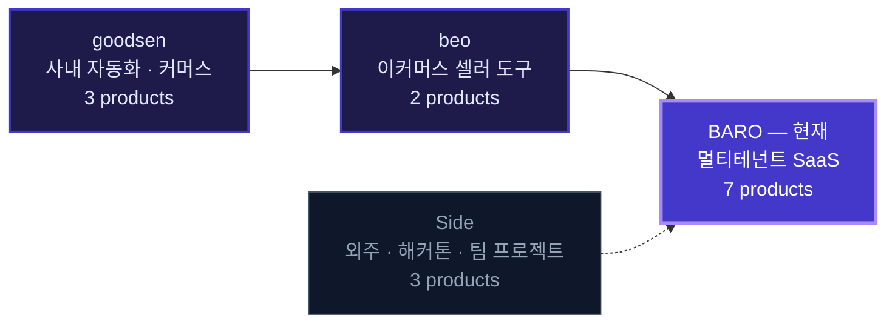
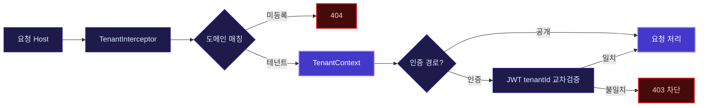

 

  

 

커밋 수는 2025.12 – 2026.08 사이 직접 작성한 것만 집계했습니다.

  

 

 

## &nbsp;`01`&nbsp;&nbsp; ABOUT

> [!NOTE]
> 현재 **BARO**에서 사내 프로덕트를 **1인 E2E**로 만들고 운영합니다.
> 멀티테넌트 SaaS 2종을 설계부터 배포까지 단독으로 책임지고 있습니다.

그 전에는 이커머스 셀러 도구와 사내 업무 자동화 시스템을 단독으로 구축했습니다. 회사 일과 별개로 외주 · 해커톤 · 사이드 프로젝트를 통해, 매번 다른 도메인의 제품을 **끝까지 완주시키는 연습**을 이어오고 있습니다.

 

<table>
<tr>
<td width="33%" align="center">   <b>끝까지 만듭니다</b>  </td>
<td width="33%" align="center">   <b>규칙을 빌드에 심습니다</b>  </td>
<td width="33%" align="center">   <b>도메인에서 시작합니다</b>  </td>
</tr>
<tr>
<td valign="top">

기획 · 스키마 설계 · 백엔드 · 프론트엔드 · 인프라 · 무중단 배포 · 운영까지 한 사람이 끊기지 않고 가져갑니다.

중간에 넘기지 않으면 문제의 원인이 어디에 있든 제가 고칠 수 있습니다.

</td>
<td valign="top">

모듈 경계 붕괴 · 인가 누락 · PII 평문 노출 같은 실수는 리뷰어의 주의력에 맡기지 않습니다.

ArchUnit 규칙과 CI가 **빌드 단계에서 차단**하도록 설계합니다.

</td>
<td valign="top">

중고차 리스 · 이커머스 · 세무회계 · 채용 · 광고.

매번 그 업계의 실제 업무 흐름을 먼저 이해한 뒤에 기능을 정의합니다.

</td>
</tr>
</table>

 

 

## &nbsp;`02`&nbsp;&nbsp; CAREER

| 시기 | 소속 | 역할 | 핵심 |
|:--|:--|:--|:--|
| **2025.12 – 현재** | **BARO** | 풀스택 · 1인 E2E | 멀티테넌트 SaaS 2종을 단독으로 설계 · 개발 · 배포 · 운영 |
| **~ 2025** | **beo** | 풀스택 · 단독 개발 | 쿠팡 셀러용 데이터 수집기와 이커머스 성과분석 플랫폼 구축 |
| **~ 2024** | **goodsen** | 개발 | 채용 자동화 · 전자책 커머스(OnClass) · SNS 계정 통합 관리 구축 |

 

 

## &nbsp;`03`&nbsp;&nbsp; WORK &nbsp;—&nbsp; BARO

 

### &nbsp; Link24 &nbsp;·&nbsp; 멀티테넌트 중고차 · 리스 시세 / 리드 SaaS

> [!IMPORTANT]
> **하나의 빌드가 접속 도메인에 따라 서로 다른 고객사의 테마 · 정책 · 데이터로 동작합니다.**
> 방문자가 차량 시세를 조회하고 상담을 남기면, 그 리드가 공정 분배 로직을 거쳐 딜러에게 자동 배정되는 구조입니다.

<table>
<tr><td width="50%" valign="top">

**직접 설계 · 구현한 것**

- **테넌트 격리** — 요청 호스트로 테넌트를 해석하고, 인증 경로에서는 JWT `tenantId`와 교차검증해 **교차 테넌트 접근 원천 차단**
- **시세 read path** — 캐시 · 조회수 롤업 · rate limit이 얽힌 공개 조회 경로를 단일 진입점으로 정리
- **공정 배정 엔진** — 가중치 · 일/시간 상한 · 쿨다운 조합
- **사이트 디자인 스튜디오** — 테넌트가 자기 사이트의 섹션 · 색상 · 템플릿을 직접 편집
- **위임 대행(login-as)** — 세션 시작 · 회수 · 감사
- **외부 시세 적재 API** — 토큰 + IP/CIDR 가드

</td><td width="50%" valign="top">

**규모와 운영**

| | |
|:--|--:|
| Java 클래스 | **403** |
| 컨트롤러 | **45** |
| 스키마 DDL | **1,251줄** |
| `.ts / .tsx` | **637** |
| 테스트 파일 | **206** |

- **ALB 타겟그룹 스왑 blue/green 무중단 배포**
- GitHub Actions self-hosted 러너
- Actuator + Prometheus 관측

</td></tr>
</table>

 

### &nbsp; BARO Homepage &nbsp;·&nbsp; 공개 사이트 + 운영 콘솔 + 통합 인증 모노레포

> [!IMPORTANT]
> **공개 웹사이트 4종, 운영 백오피스, 인증 인프라를 한 저장소에서 운영합니다.**
> 방문자는 포트폴리오와 마케팅 인사이트를 보고 문의 · 결제까지 진행하고, 임직원은 SSO로 로그인해 콘텐츠 · 고객사 · 권한 · 결제를 한곳에서 관리합니다.

<table>
<tr><td width="50%" valign="top">

**직접 설계 · 구현한 것**

- **인증 인프라 분리** — Keycloak 26 SSO + DB 기반 RBAC(`resource:action`), 통합로그인 **BFF를 별도 서비스로 분리**
- **포트폴리오 에디터** — 문서형 캔버스, 실시간 분할 미리보기, 낙관적 잠금, 소프트 삭제 / 휴지통
- **고객사 360° 워크벤치** — 문의 · 결제 · 계약 이력을 한 화면으로
- **문의 티켓 처리대** — 2-pane, 배정 · 상태 전이 · **전환 계측**
- **감사 로그** — 변경 전 / 후 diff 추적
- **LLM 뉴스 인제스트** — 수집 → LLM 재작성 → **5단계 자동 발행 게이트**

</td><td width="50%" valign="top">

**규모와 운영**

| | |
|:--|--:|
| 프론트 앱 | **5** |
| 백엔드 도메인 | **13** |
| Flyway 마이그레이션 | **123** |
| CI/CD 워크플로 | **6** |

- main · hub · careers · web-production · admin
- **edge nginx graceful reload blue/green 무중단 배포**
- EC2 Docker Compose(app · auth) + ECS Fargate(Keycloak) 이원 런타임

</td></tr>
</table>

 

### &nbsp; BAROS 2.0 &nbsp;·&nbsp; 리드 수집 → 배분 → 결과 학습 3계층 SaaS

> [!IMPORTANT]
> **자동차 리스 · 렌트 리드를 모바일 랜딩으로 모아 → 규칙대로 배분하고 → 계약 결과를 되받아 학습하는 플랫폼입니다.**
> 3인 병렬 개발을 전제로, 레거시에서 반복되던 결함이 **사람의 주의력이 아니라 빌드에서** 막히도록 골격을 설계했습니다.

<table>
<tr><th width="34%">빌드가 막는 것</th><th>어떻게</th></tr>
<tr><td><b>모듈 경계 붕괴 · 인가 누락 문자열 SQL · 로그 PII</b></td><td><b>ArchUnit 8종 규칙</b> — 위반 시 <b>빌드 실패</b>. 리뷰가 아니라 빌드에서 떨어집니다.</td></tr>
<tr><td><b>권한 상승</b></td><td><b>테넌시 자동 주입</b> — <code>WHERE org_id = ?</code>를 개발자가 잊을 수 <b>없는</b> 구조</td></tr>
<tr><td><b>스키마와 쿼리의 조용한 불일치</b></td><td><b>jOOQ 코드젠</b>이 매 빌드마다 마이그레이션에서 출발</td></tr>
<tr><td><b>PII 평문 노출 중복판정 풀스캔</b></td><td><b>PII 분리 테이블</b> + AES-256-GCM 암호화 + HMAC 해시 검색</td></tr>
<tr><td><b>시크릿 커밋</b></td><td><b>gitleaks CI</b></td></tr>
<tr><td><b>가짜 성공 응답 조용히 흡수되는 INSERT 실패</b></td><td><b>트랜잭션 경계 = 응답 경계</b></td></tr>
</table>

**구조** — 단일 배포 단위 위의 **모듈러 모놀리스 11모듈**. 모듈 간에는 상대의 `api` 인터페이스만 참조하고 엔티티 공유와 크로스 JOIN은 금지합니다. 비동기는 도메인 이벤트로 — `ApplicationEventPublisher` → `outbox` → SQS. 진행은 날짜가 아니라 **게이트 G0~G5**로 관리합니다.

 

<b>&nbsp;🛠&nbsp; 사내 자동화 도구 · 데이터 파이프라인 4종</b> &nbsp;펼쳐보기

 

<table>
<tr><td width="30%" valign="top">

**Call Matcher** `v1.4.0` 
Windows 데스크톱 도구

</td><td valign="top">

손으로 정리한 콜보고를 업체별 **문자(SMS)** · **050 콜로그(CDR)** 와 자동 대조하고, 결과를 Google Sheets로 전송합니다. 콜보고에 풀번호가 있으면 정확 매칭하고, 없으면 **뒷 4자리로 폴백**합니다. AM팀에 단일 `.exe`로 배포했습니다.

</td></tr>
<tr><td valign="top">

**AI Task Pipeline** 
LLM 태스크 백엔드

</td><td valign="top">

뉴스 심사 · 재작성, 브랜드 광고비 인사이트 같은 LLM 작업을 **프롬프트 · 가드 · 파싱 · 재시도**로 분리해, LLM을 신뢰 가능한 파이프라인 부품으로 다룹니다. 결과는 알림톡 발송까지 연결됩니다.

</td></tr>
<tr><td valign="top">

**Ad / Log 대시보드**

</td><td valign="top">

광고 집행 관리와 네거티브 클릭 로그 분석 프론트엔드.

</td></tr>
<tr><td valign="top">

**Cars Data Pipeline**

</td><td valign="top">

차량 카탈로그 · 시세 원본을 정규화해 서비스 DB로 적재합니다.

</td></tr>
</table>

 

 

## &nbsp;`04`&nbsp;&nbsp; WORK &nbsp;—&nbsp; beo

 

### &nbsp; 쿠팡 구매량 추적기 &nbsp;·&nbsp; 이커머스 성과분석 플랫폼

> [!IMPORTANT]
> **쿠팡 셀러가 흩어져 보던 광고 · 매출 · 키워드 데이터를 한 화면으로 모았습니다.**
> 브라우저 확장 프로그램이 판매 데이터를 수집하고, 대시보드가 그 데이터를 마진 · 광고 효율 · 키워드 순위로 풀어냅니다.

- **구매량 추적기** — 상품별 판매 추이를 자동 수집하는 크롬 확장 프로그램
- **성과분석 대시보드** — 마진 계산, 광고 효율(ROAS) 분석, 키워드 순위 추적
- 수작업으로 하던 데이터 취합을 자동화해, 셀러가 **판단에 쓸 시간**을 남겼습니다

 

 

## &nbsp;`05`&nbsp;&nbsp; WORK &nbsp;—&nbsp; goodsen

 

### &nbsp; 인사팀 채용 자동화 프로그램

> [!IMPORTANT]
> **채용 담당자의 반복 업무를 자동화해 업무 효율을 60% 끌어올렸습니다.**

브라우저에서 손으로 반복하던 채용 업무를 **Selenium으로 자동화한 데스크톱 프로그램**입니다. 담당자가 지원자 검토와 판단이라는 본래 업무에 집중할 수 있도록 만들었습니다.

 

### &nbsp; SNS 매체 계정 통합 관리 플랫폼

> [!IMPORTANT]
> **120개의 매체 계정을 하나의 컨트롤 타워에서 관리합니다.**

계정마다 따로 로그인해 관리하던 구조를 단일 콘솔로 통합했습니다. 계정 수에 비례해 늘어나던 운영 비용을 구조적으로 끊어낸 작업입니다.

 

### &nbsp; OnClass &nbsp;·&nbsp; 전자책 이커머스 판매 플랫폼

> [!IMPORTANT]
> **전자책 상품의 등록 · 판매 · 결제까지 다루는 커머스 플랫폼을 구축했습니다.**

Spring 기반 API 위에 Vue.js SPA를 올린 구조로, 상품 · 주문 · 결제 데이터를 MySQL로 다뤘습니다.

 

 

## &nbsp;`06`&nbsp;&nbsp; WORK &nbsp;—&nbsp; 외주 · 해커톤 · 사이드

 

### &nbsp; 세무회계 현 &nbsp;·&nbsp; 홈페이지 + CRM 콘솔

> [!IMPORTANT]
> **세무법인 공개 홈페이지와 직원용 CRM을 하나의 흐름으로 이었습니다.**
> 공개 문의가 들어오면 이메일 / 전화 기준으로 고객 레코드에 자동 연결되고, 그 고객이 상담 · 세무기한 · 내부업무 · 후속조치 일정으로 이어집니다.

- 백엔드 도메인 **11종** — 고객 · 문의 · 세무건 · 업무 · 일정 · 문서 · 동의 · 활동로그 · 사이트 콘텐츠
- Flyway + `ddl-auto=validate`로 엔티티와 실제 스키마의 불일치를 기동 시점에 차단
- **H2 + Testcontainers 이중 테스트** — 빠른 피드백과 실제 마이그레이션 검증을 분리
- 브랜드 시스템 직접 설계 — 딥네이비 톤, 로고 라인드로우 애니메이션, `prefers-reduced-motion` 대응

 

### &nbsp; PlanFlow &nbsp;·&nbsp; 워크스페이스 우선 협업 플랫폼

> [!IMPORTANT]
> **프로젝트 · 일정 · 문서 · GitHub · 채팅을 워크스페이스 단위로 격리해 다룹니다.**
> 기획부터 개발 · 제출까지 혼자 완주했습니다.

<table>
<tr><td width="50%" valign="top">

- **기획과 실행** — 스프린트 / 에픽 · 보드 · 캘린더 · QA 항목 · 워크플로 제안
- **실시간 협업** — STOMP / SockJS 기반 그룹 채팅 · DM · 프레즌스 · 알림 인박스
- **GitHub App 연동** — 저장소 연결, 커밋 / PR 동기화, 태스크 ↔ PR 링크

</td><td width="50%" valign="top">

- **AI 어시스트** — 스마트 태스크 배정, 리스크 / QA 루프, 기획 제안
- **팀 자격증명** — reveal 플로우와 감사 기록을 갖춘 공유 시크릿 관리
- Polar 구독 결제 · 웹훅, S3 파일 스토리지, PDF / Office 텍스트 추출

</td></tr>
</table>

 

### &nbsp; OneStack &nbsp;·&nbsp; IT 전문가 매칭 & 협업 플랫폼

> [!IMPORTANT]
> **IT 전문가와 프로젝트를 매칭하고, 실시간 채팅 · 화상회의로 협업하는 커뮤니티 플랫폼입니다.**

요구사항 정의, 아키텍처 설계, 핵심 기능 개발, 배포까지 리딩했습니다.

 

 

## &nbsp;`07`&nbsp;&nbsp; HOW I WORK

> [!TIP]
> 아래는 슬로건이 아니라, 실제 운영 중인 저장소에 들어가 있는 규칙입니다.

<table>
<tr>
<td width="50%" valign="top">

#### 🔒 규칙은 문서가 아니라 빌드가 지킨다

모듈 경계 · 인가 누락 · 문자열 SQL · 로그 PII를 ArchUnit 규칙으로 **빌드 실패** 처리합니다. 리뷰어의 주의력에 의존하는 규칙은 결국 무너진다고 봅니다.

</td>
<td width="50%" valign="top">

#### 📐 문서와 코드가 어긋나면 문서가 옳다

마스터플랜을 기준선으로 두고, 불일치는 코드를 고치거나 근거를 단 개정 PR로 해소합니다.

</td>
</tr>
<tr>
<td valign="top">

#### 🗄 스키마 변경 경로는 하나뿐이다

Flyway 전용 · 타임스탬프 파일명 · 인덱스 필수. 직접 DDL과 병렬 개발 시의 번호 충돌을 구조적으로 차단합니다.

</td>
<td valign="top">

#### ♻️ 배포는 되돌릴 수 있어야 한다

blue/green 무중단 배포 + 헬스체크 기반 전환. 릴리스는 SemVer / Keep a Changelog로 자동화합니다.

</td>
</tr>
<tr>
<td valign="top">

#### 🛡 민감정보는 구조로 분리한다

PII 별도 테이블 · AES-256-GCM 암호화 · HMAC 해시 검색 · gitleaks CI.

</td>
<td valign="top">

#### 🤖 경계 케이스에는 LLM을 도구로 쓴다

프롬프트 · 가드 · 파싱 · 재시도를 코드로 분리해, LLM을 신뢰 가능한 파이프라인 부품으로 다룹니다.

</td>
</tr>
</table>

 

 

## &nbsp;`08`&nbsp;&nbsp; TECH STACK

 

**Backend & Language**

**Frontend**

**Data**

**Infra & Ops**

 

 

 

## &nbsp;`09`&nbsp;&nbsp; STATS

 

 

 

 

 

## &nbsp;`10`&nbsp;&nbsp; CONTACT

 

  

